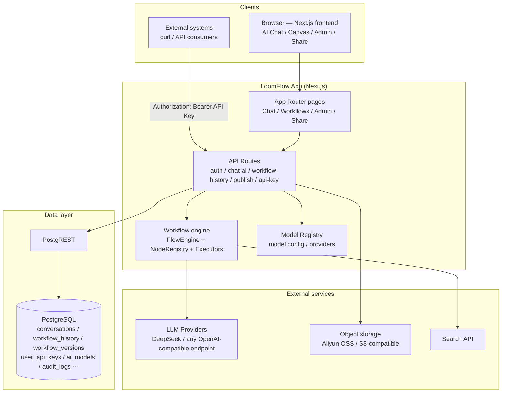
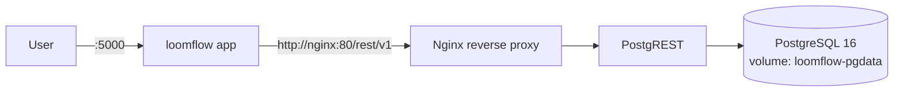

# LoomFlow

> English | [中文](README.zh-CN.md)

**A lightweight AI workflow builder for individuals and small teams.**

Describe your idea in natural language → generate a runnable workflow → customize it on a visual canvas → publish it as an API.

*Everyone should be able to create their own AI automation flows.*

---

## 📸 Screenshots


---

## 🎯 Who is it for?

- ✅ **Indie developers** — ship an AI feature without building an orchestration platform
- ✅ **Content creators** — turn recurring production steps into one-click automated flows
- ✅ **Small studios** — deliver demos and client work faster with shareable, runnable flows
- ✅ **AI automation enthusiasts** — prototype your idea in minutes, then deploy it for real

## 🤔 Why LoomFlow instead of Dify / n8n?

| | **LoomFlow** | Dify | n8n |
|---|---|---|---|
| Getting started | **Natural language → runnable workflow**, seconds to start | Templates / manual setup, enterprise-grade LLM app platform | Drag nodes manually, AI is just one of many node types |
| Positioning | Lightweight · individuals / small teams · **AI-first** | Heavy: RAG / knowledge bases / team collaboration / complex deployment | General automation, many node types |
| Deployment | **One-command Docker self-hosting** (1 GB RAM is enough) | Heavy | Moderate |
| Output | One-click publish as an **authenticated HTTP API** + share pages | App / workflow centric | Webhook / API |

**In one sentence**: Dify builds LLM app platforms for teams, n8n does general automation for everyone — **LoomFlow turns "one sentence" into a runnable, publishable workflow for individuals and small teams**. It doesn't chase comprehensiveness — it pursues a 30-second learning curve and a one-minute deployment.

---

## ✨ Highlights

### 💬 Natural Language → Workflow
No drag-and-drop required to start — just **describe your process in plain language**, and the AI generates an executable workflow directly onto the canvas:

> **You:** "Build me a workflow: input a product name → AI generates selling-point copy → generates a promo video script"
>
> **AI:** ✅ Generated a 4-node workflow (Start → LLM Copy → LLM Script → End), loaded to canvas

Then fine-tune visually and publish as an API.

### 🎨 Visual Canvas
Tinyflow canvas editor: drag nodes, connect flows, configure parameters. 10 node types (LLM / HTTP / Code / Template / Loop / Human Confirm, etc.).

### 🚀 Workflow as API
One-click publish a workflow as an HTTP endpoint — **one global API Key calls all of your published workflows**, with unlimited calls and call logs:

```bash
curl -X POST https://your-host/api/publish/{workflowId}/execute \
  -H "Authorization: Bearer ffk_xxxxx" \
  -H "Content-Type: application/json" \
  -d '{"inputs": {"query": "..."}}'
```

> The API Key is auto-generated on first publish and shown only once; when it expires, regenerate it on the **API Keys** page.

### 🔗 Shareable Workflow Pages
Generate a public link — recipients can view nodes, fill inputs, and run the workflow without signing in. Perfect for demos and delivery.

### 🏢 Team & Permissions
- Full data isolation (including admin)
- No call limits — chat & API calls are unlimited
- Audit logs for all critical operations

### 📊 Admin Dashboard
User management, usage statistics (trends), audit logs, API call logs.

### 🌐 Internationalization
Chinese/English one-click switch (framework supports any language).

### 🔒 Self-Hosted & Private
App, data, and storage can all be deployed on your own server. Database can be switched to self-hosted PostgreSQL (see Deployment Manual).

### 🧩 Extensible Node System
`NodeRegistry` + `NodeDefinition` — a single source of truth for nodes. Custom nodes can be registered with one entry, with automated validation (executor binding, start/end singleton).

### 🧠 Bring Your Own Model
Add **any model** (DeepSeek / Ark / any OpenAI-compatible endpoint) through the admin UI — **no code changes**:

- Per-model API key & base URL (overrides environment defaults)
- Declare capabilities (text / vision / ...) — vision models enable image input automatically
- Canvas & chat model lists sync instantly after adding

```text
Admin → Model Settings → Add Model
  id: qwen-vl-max · provider: openai-compatible
  base URL: https://... · api key: sk-...
  capabilities: [text, vision]  →  ✅ instantly available everywhere
```

---

## 🏗️ Architecture



**How it flows**: describe a process in natural language → AI generates a workflow (validated & auto-repaired) → edit on the visual canvas → save as versioned history → publish a chosen version as a secured HTTP API (one global API key per user) → external systems call it with `Authorization: Bearer <key>`.

**Docker self-hosted deployment**:



## 🚀 Quick Start

### 🐳 Docker (recommended, one-click self-hosted)

Includes **PostgreSQL + PostgREST + Nginx** — fully self-contained, no Supabase cloud required.

```bash
git clone https://github.com/banmu123/LoomFlow.git
cd LoomFlow
cp .env.example .env
# Required env setup:
#   POSTGRES_PASSWORD  → your strong password (openssl rand -hex 12)
#   PGRST_JWT_SECRET   → random string (openssl rand -hex 32)
#   COZE_SUPABASE_SERVICE_ROLE_KEY → generated via:
#     node docker/generate-service-role-key.mjs $PGRST_JWT_SECRET
docker compose up -d   # auto-initializes database (tables + default admin)
```

- Access: http://localhost:5000
- Default admin: `admin` / `123456`（⚠️ change after first login）
- Data persists in Docker volume; logs: `docker compose logs -f loomflow`
- Stop: `docker compose down` — full guide: [docs/docker-deploy.md](docs/docker-deploy.md)

### 🧑‍💻 Local Development

Requirements: Node.js ≥ 20.9, pnpm 9+, a Supabase project.

```bash
# 1. Install dependencies
pnpm install

# 2. Configure environment
cp .env.example .env.local
```

Environment variables (where to get them):

| Variable | Where to get |
|----------|--------------|
| `COZE_SUPABASE_URL` | Supabase → Project Settings → API |
| `COZE_SUPABASE_SERVICE_ROLE_KEY` | Supabase → Project Settings → API (service_role) |
| `DEEPSEEK_API_KEY` | [platform.deepseek.com](https://platform.deepseek.com) → API Keys |
| `AUTH_SECRET` | `openssl rand -hex 32` |

```bash
# 3. Initialize database — Database Setup Checklist
#    Create Supabase project → SQL Editor → run in order:
#    ① scripts/supabase-init.sql
#    ② scripts/supabase-users.sql   ← ⚠️ set your own admin password BEFORE running
#    ③ scripts/supabase-updates.sql
#    ④ scripts/supabase-apikeys.sql  ← global API Key table (idempotent)
#    Verify tables: conversations / messages / workflow_history / users / ai_models ...

# 4. Start
pnpm dev
```

Open http://localhost:5000.

> ⚠️ **Security**: the initial admin account password is set inside `supabase-users.sql` — **change it to a strong password before the first deployment**. It cannot be auto-forced, so treat this as a required step.

### 🚀 Production / Self-Host

Full guide: **[docs/config/Deployment-Manual.md](docs/config/Deployment-Manual.md)**

```bash
pnpm build
COZE_PROJECT_ENV=PROD PORT=5000 pm2 start dist/server.js --name loomflow
pm2 save
```

Minimum server: 1 CPU / 1 GB RAM / Ubuntu 20.04+ / Node ≥ 20.9.

### 🗄️ Self-Hosted PostgreSQL

Switch from Supabase cloud to your own PostgreSQL via **Docker self-hosted Supabase** — zero code changes. See [Deployment Manual §11](docs/config/Deployment-Manual.md).

### ✅ Post-Deploy Verification

```bash
curl http://localhost:5000/api/health
# {"status":"ok","service":"loomflow","version":"v0.1.2",...}
```

Checklist:
- ✅ `http://localhost:5000` opens (login page)
- ✅ Sign in with admin account
- ✅ Workflow canvas loads
- ✅ Create a simple workflow → save
- ✅ Publish as API → call it with the API key

## 📚 Documentation

- **[Roadmap](ROADMAP.md)** — where the project is heading (v0.1 → v0.5)
- **[Architecture](docs/config/architecture.md)** — from natural language to executable API, end-to-end
- **[Security](docs/config/security.md)** — sandbox, auth, quotas, audit, isolation
- **[Node System Architecture](docs/nodes.md)** — NodeDefinition/Registry/Factory, configSchema, plugin SDK
- **[Deployment Manual](docs/config/Deployment-Manual.md)** — self-host, migrate, HTTPS

---

## 🏗️ Tech Stack

| Layer | Technology |
|-------|-----------|
| Frontend | Next.js 16 (App Router) + React 19 + Tailwind CSS 4 + shadcn/ui |
| Canvas | @tinyflow-ai/ui |
| AI | AI SDK v7 + DeepSeek (OpenAI-compatible, switchable to any model) |
| Database | Supabase (PostgreSQL) / self-hosted PostgreSQL |
| Storage | Aliyun OSS / S3-compatible |
| Deployment | pm2 + Nginx + one-click deploy script |

---

## 📁 Project Structure

```
src/
├── app/                  # Pages & API routes
│   ├── (main)/           # Main UI (chat + workflows + admin)
│   ├── share/            # Public workflow share pages
│   └── api/              # Backend APIs (auth / conversations / publish / admin / nodes)
├── components/           # UI components
├── lib/
│   ├── tinyflow/         # Workflow execution engine + NodeRegistry/NodeDefinition
│   ├── ai/               # Model Registry (providers / capabilities / models)
│   ├── workflow-ai/      # AI workflow generation prompts
│   └── i18n.tsx          # i18n framework
├── messages/             # zh/en translations
└── scripts/              # SQL init + deploy scripts
```

---

## 🧪 Testing & CI

- **Vitest** — 209 unit tests (engine, schema, sandbox, executors, search providers, secrets encryption, model registry, node registry, agent tools, i18n)
- **GitHub Actions** — lint + typecheck + test + production build on every push (Node 20/22 matrix)

---

## 📄 License

[MIT](LICENSE)

## 🙏 Credits

- [Tinyflow](https://github.com/tinyflow-ai) — workflow canvas
- [AI SDK](https://ai-sdk.dev/) — LLM streaming
- [shadcn/ui](https://ui.shadcn.com) — UI components
