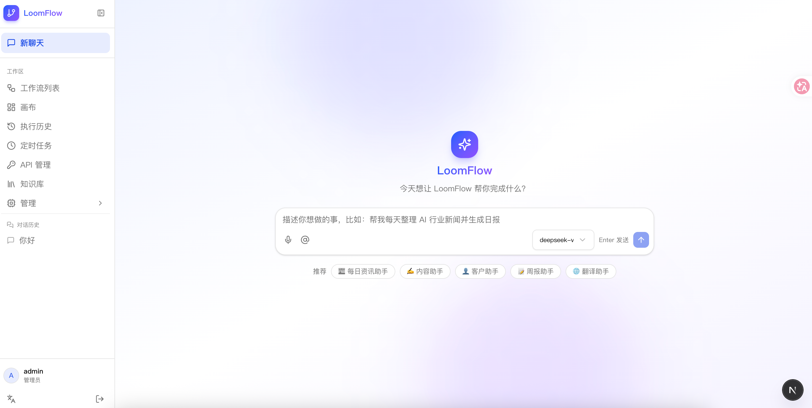
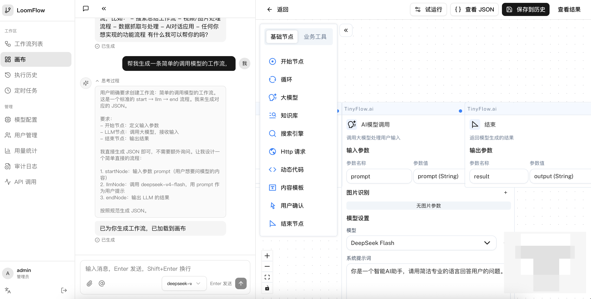
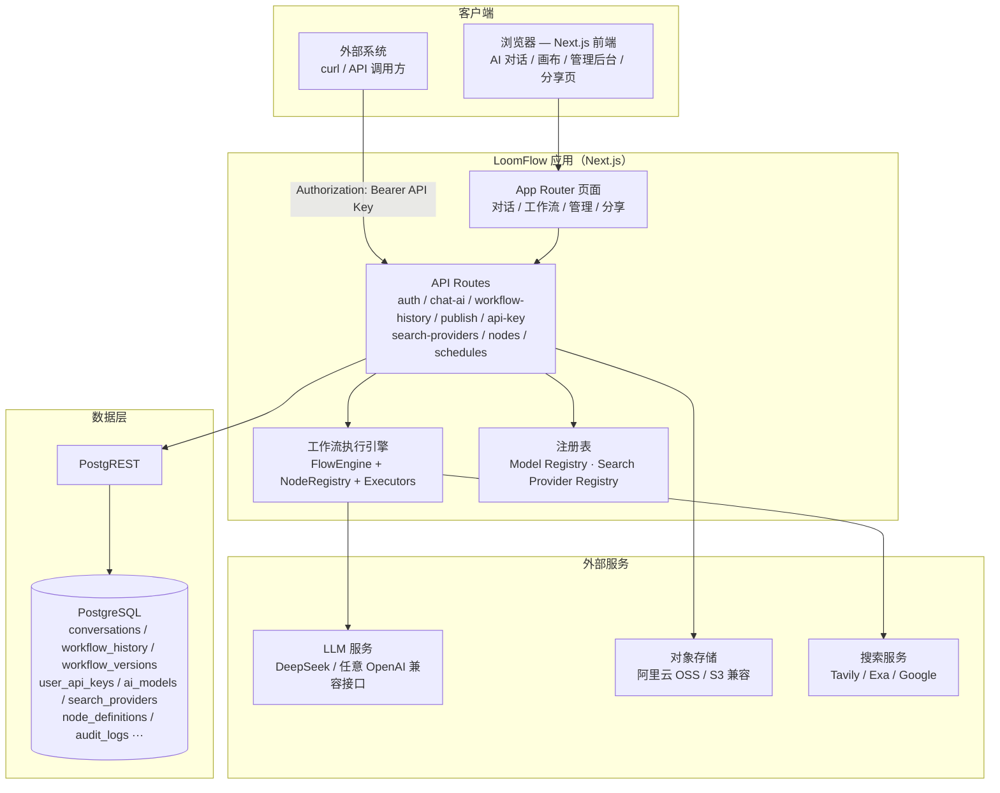
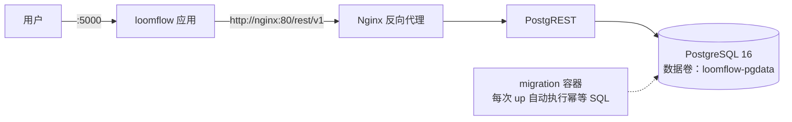

# LoomFlow

> [English](README.md) | 中文

<p align="center">
  
</p>

**为个人和小团队打造的轻量级 AI 工作流构建器。**

用自然语言描述想法 → 生成可运行的工作流 → 画布上自由调整 → 一键发布为 API。

让每个人都能创建自己的 AI 自动化流程。

---

## 📸 界面截图





---

## 🎯 适合谁用？

- ✅ **独立开发者** — 想给产品加 AI 能力，但不想自己搭一套编排平台
- ✅ **内容创作者** — 把重复的生产步骤变成一键自动流程
- ✅ **小型工作室** — 用可分享、可试运行的流程更快交付演示和客户项目
- ✅ **AI 自动化爱好者** — 几分钟做出原型，然后正式部署跑起来

## 🤔 为什么不用 Dify / n8n？

| | **LoomFlow** | Dify | n8n |
|---|---|---|---|
| 起步方式 | **自然语言直接生成工作流**，秒级开始 | 模板/手动搭建，偏企业级 LLM 应用平台 | 手动拖节点，AI 只是众多节点之一 |
| 定位 | 轻量 · 个人/小团队 · **AI 优先** | 重：RAG/知识库/团队协作/复杂部署 | 通用自动化，节点多而杂 |
| 部署 | **一条命令 Docker 自托管**（1GB 内存即可） | 较重 | 中等 |
| 对外提供 | 一键发布为带鉴权的 HTTP API + 分享页 | 应用/工作流为主 | Webhook/API |

**一句话**：Dify 是给团队造 LLM 应用平台的，n8n 是给所有人做通用自动化的——**LoomFlow 是给个人和小团队"用一句话把想法变成可运行、可发布的工作流"**。不追求大而全，追求 30 秒上手、一分钟部署。

**边界**：LoomFlow **不是** AI 教练、个人成长应用或编程练习平台。它刻意保持聚焦——只做一件事：*自然语言 → 工作流 → 画布 → API*。不服务于这条主线的功能，都排除在核心产品之外。

---

## ✨ 功能亮点

### 💬 自然语言生成工作流
不需要从零拖拽——**用大白话描述流程**，AI 直接生成可执行的工作流加载到画布：

> **你：** "帮我做一个流程：输入产品名，AI 生成卖点文案，再生成推广视频脚本"
>
> **AI：** ✅ 已生成 4 节点工作流（开始 → LLM 文案 → LLM 脚本 → 结束），已加载到画布

之后可视化微调，一键发布为 API。

### 🎨 可视化画布
Tinyflow 画布编辑器：拖拽节点、连接流程、配置参数，支持 12 种节点（LLM / HTTP / 代码 / 模板 / 搜索 / Excel / 循环 / 人工确认等）。

### 🚀 工作流即 API
一键发布工作流为 HTTP 接口（**一个全局 API Key 调用你所有已发布工作流**，不限调用次数，含调用日志），外部系统直接对接：

```bash
curl -X POST https://your-host/api/publish/{workflowId}/execute \
  -H "Authorization: Bearer ffk_xxxxx" \
  -H "Content-Type: application/json" \
  -d '{"inputs": {"query": "..."}}'
```

> API Key 首次发布时自动生成、只显示一次；过期后在「API 管理」页重新生成即可恢复。

### 🔗 工作流分享页
生成公开链接，对方无需登录即可查看流程节点、填写输入、试运行——演示/交付利器。

### 🏢 团队与权限
- 用户隔离（数据完全互相不可见，含 admin）
- 无次数限制（对话与 API 调用均不限次数）
- 审计日志（登录、操作全记录）

### 📊 管理后台
用户管理、用量统计（趋势图）、审计日志、API 调用日志。

### 🌐 国际化
中英双语一键切换（框架支持扩展任意语言）。

### 📝 Brew Notes（工作流笔记）
记录工作流**为什么这样设计**——决策、问题、方案、优化、用途。AI 可总结设计意图、基于运行记录建议新笔记，画布 AI 助手能根据笔记回答「为什么当时选 X」。

### 🕵️ 节点级执行追踪 & Debug 助手
每次运行后展示**节点级执行时间线**：每个节点的状态/耗时/模型/Tokens/错误——一眼看清卡在哪。**画布 AI 助手**读取运行历史，回答「为什么运行失败」并给出根因与修复建议。

### 🤖 画布 AI 助手
在画布上直接对话：询问当前工作流、描述修改需求（如"给搜索结果加一个总结节点"），AI 输出完整工作流 JSON，**一键应用到画布**。

### 🔒 私有化部署
应用 + 数据 + 存储都可部署在自己服务器；数据库可切换自建 PostgreSQL（详见部署手册）。

---

## 🏗️ 架构图



**核心流程**：自然语言描述流程 → AI 生成工作流（Schema 校验 + 失败自动修复）→ 画布可视化微调 → 保存为版本历史 → 发布指定版本为带鉴权的 HTTP API（每用户一个全局 API Key）→ 外部系统凭 `Authorization: Bearer <key>` 调用。

**Docker 自托管部署**：



## 🚀 快速开始

### 🐳 Docker 部署（推荐，一键自托管）

**内置 PostgreSQL + PostgREST + Nginx**——完全自包含，**无需 Supabase 云**。

```bash
git clone https://github.com/banmu123/LoomFlow.git
cd LoomFlow
bash scripts/init-env.sh   # 一次性：自动生成 .env 全部密钥（随机强密码 + JWT 签名）
docker compose up -d      # 自动初始化数据库（含默认 admin 账号）
```

部署后在界面添加 AI 模型（无需在 .env 填 key）：

1. 打开 http://localhost:5000 → 登录（`admin` / `123456`，请立即修改）
2. **管理后台 → 模型配置 → 添加模型**（如 DeepSeek：填模型 ID + API Key，或任意 OpenAI 兼容端点）
3. 可选：管理后台 → 搜索配置 / 存储设置 等

- 访问：http://localhost:5000
- 默认账号：`admin` / `123456`（⚠️ 首次登录后请立即修改）
- 数据持久化在 Docker 卷；日志：`docker compose logs -f loomflow`
- 停止：`docker compose down` —— 完整指南：[docs/docker-deploy.md](docs/docker-deploy.md)

### 🧑‍💻 本地开发

环境要求：Node.js ≥ 20.9、pnpm 9+、一个 Supabase 项目。

```bash
# 1. 安装依赖
pnpm install

# 2. 配置环境变量
cp .env.example .env.local
```

环境变量（从哪里获取）：

| 变量 | 获取方式 |
|------|---------|
| `COZE_SUPABASE_URL` | Supabase → Project Settings → API |
| `COZE_SUPABASE_SERVICE_ROLE_KEY` | Supabase → Project Settings → API（service_role） |
| `DEEPSEEK_API_KEY` | [platform.deepseek.com](https://platform.deepseek.com) → API Keys |
| `AUTH_SECRET` | `openssl rand -hex 32` |

```bash
# 3. 初始化数据库 —— 数据库设置清单
#    创建 Supabase 项目 → SQL Editor → 按顺序执行：
#    ① scripts/supabase-init.sql
#    ② scripts/supabase-users.sql   ← ⚠️ 执行前先把默认 admin 密码改成你自己的
#    ③ scripts/supabase-updates.sql
#    ④ scripts/supabase-apikeys.sql  ← 全局 API Key 表（可重复执行）
#    ⑤ scripts/supabase-versions.sql
#    ⑥ scripts/supabase-publish-version.sql
#    ⑦ scripts/supabase-knowledge.sql
#    ⑧ scripts/supabase-settings.sql
#    验证表：conversations / messages / workflow_history / users / ai_models / search_providers ...
#    💡 Docker 自托管自动执行 ①-⑧（initdb + migration 容器），无需手动跑 SQL

# 4. 启动
pnpm dev
```

打开 http://localhost:5000。

> ⚠️ **安全提示**：初始 admin 密码在 `supabase-users.sql` 中设置——**首次部署前必须修改为强密码**。系统无法自动强制，请把它视为必做步骤。

### 🚀 生产部署 / 自托管

完整指南：**[docs/config/Deployment-Manual.md](docs/config/Deployment-Manual.md)**

**Docker Compose（推荐）** — 应用 + PostgreSQL + PostgREST + Nginx + migration 全容器化，本地一条命令更新：

```bash
SERVER_IP=你的服务器 ./scripts/deploy-docker.sh
# 1/6 同步代码 → 2/6 解压 → 3/6 数据库迁移 + 权限自检
# 4/6 重建并重启 → 5/6 等待健康 → 6/6 验证版本与数据层
```

最低服务器：1 核 CPU / 1GB 内存 / Ubuntu 20.04+ / Node ≥ 20.9。

### 🗄️ 自建 PostgreSQL

通过 **Docker 自托管 Supabase** 从云切换到自己的 PostgreSQL——**代码零改动**。见[部署手册第十一章](docs/config/Deployment-Manual.md)。

### ✅ 部署后验证

```bash
curl http://localhost:5000/api/health
# {"status":"ok","service":"loomflow","version":"v0.1.7","db":"ok",...}
```

检查清单：
- ✅ `http://localhost:5000` 可打开（登录页）
- ✅ admin 账号可登录
- ✅ 工作流画布可加载
- ✅ 创建一个简单工作流 → 保存
- ✅ 发布为 API → 用 API Key 调用

## 📚 文档

- **[Roadmap 路线图](ROADMAP.md)** — 项目规划（v0.1 → v0.5）
- **[架构说明](docs/config/architecture.md)** — 从自然语言到可执行 API 的完整链路
- **[安全设计](docs/config/security.md)** — 沙箱/认证/配额/审计/隔离
- **[节点系统架构](docs/nodes.md)** — NodeDefinition/Registry/Factory、configSchema、插件 SDK
- **[部署手册](docs/config/Deployment-Manual.md)** — 自托管/迁移/HTTPS

---

## 🏗️ 技术栈

| 层 | 技术 |
|----|------|
| 前端 | Next.js 16 (App Router) + React 19 + Tailwind CSS 4 + shadcn/ui |
| 画布 | @tinyflow-ai/ui |
| AI | AI SDK v7 + DeepSeek（OpenAI 兼容，可切换任意模型） |
| 数据库 | Supabase (PostgreSQL) / 自建 PostgreSQL |
| 存储 | 阿里云 OSS / S3 兼容 |
| 部署 | Docker Compose 自托管（一键）+ 部署脚本 |

---

## 📁 项目结构

```
src/
├── app/                  # 页面与 API 路由
│   ├── (main)/           # 主界面（对话 + 工作流 + 管理后台）
│   ├── share/            # 工作流分享页
│   └── api/              # 后端 API（auth / conversations / workflow-history / publish / admin / nodes / search-providers）
├── components/           # UI 组件
├── lib/
│   ├── tinyflow/         # 工作流执行引擎（12 种节点执行器）
│   ├── search/           # 搜索适配层（Tavily / Exa / Google）
│   ├── ai/               # 模型注册表（providers / capabilities / models）
│   ├── agent/            # AI 对话工具（create_custom_node、知识库、统计等）
│   ├── workflow-ai/      # AI 生成工作流提示词
│   ├── secrets.ts        # 敏感配置加密（AES-256-GCM）
│   └── i18n.tsx          # 国际化框架
├── messages/             # 中英文案
└── scripts/              # SQL 初始化 + 构建/部署脚本
```

---

## 🧪 测试与 CI

- **Vitest** — 493 个单元测试（引擎、schema、沙箱、执行器、搜索适配层、密钥加密、执行追踪、笔记、模型注册表、节点注册表、Agent 工具、i18n）
- **GitHub Actions** — 每次推送自动执行 lint + 类型检查 + 测试 + 生产构建（Node 20/22 矩阵）

---

## 📄 开源协议

[MIT](LICENSE)

## 🙏 致谢

- [Tinyflow](https://github.com/tinyflow-ai) — 工作流画布
- [AI SDK](https://ai-sdk.dev/) — LLM 流式调用
- [shadcn/ui](https://ui.shadcn.com) — UI 组件
